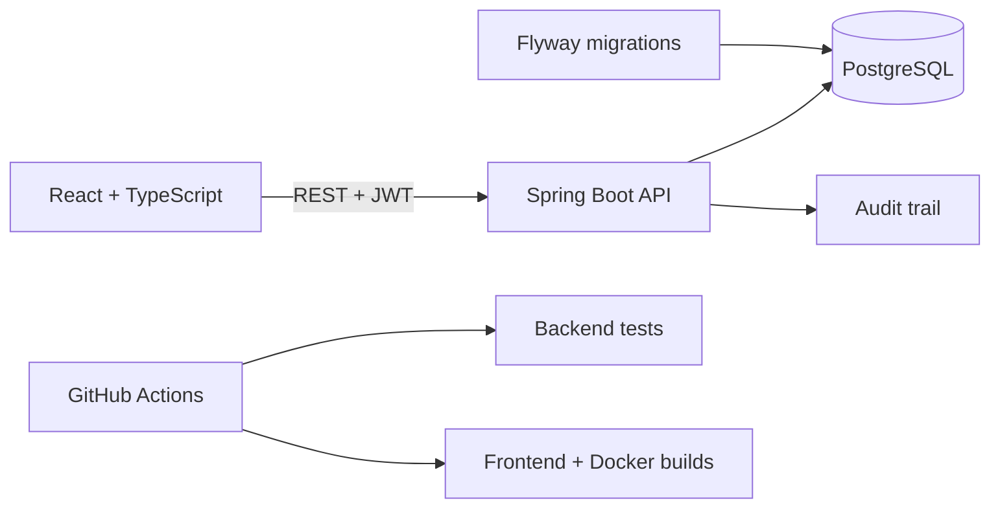

# LinePulse

Industrial maintenance and operations platform for managing production assets, incidents, maintenance work orders, downtime and operational indicators.

## Stack

### Backend
- Java 21
- Spring Boot
- Spring Web
- Spring Security
- Spring Data JPA
- Bean Validation
- JWT authentication
- OpenAPI / Swagger UI
- PostgreSQL
- Flyway
- Maven

### Testing
- JUnit 5
- Mockito
- Spring Boot Test
- Testcontainers with PostgreSQL

### Frontend
- React
- TypeScript
- Vite
- TanStack Query
- Axios
- Recharts
- Lucide React
- Nginx

### Infrastructure
- Docker
- Docker Compose
- GitHub Actions

## Architecture



The backend follows a layered flow for the main domains:

```text
Controller -> Service -> Repository -> PostgreSQL
```

## Documentation

- [Architecture decisions and technical flows](docs/architecture.md)
- [Domain model and lifecycle rules](docs/domain-model.md)

## Roles

- `ADMIN` — administrative access, machine registration, user management and operational management
- `TECHNICIAN` — maintenance operations, incident handling and machine status management
- `OPERATOR` — operational access and incident reporting

## Current features

- Closed-access authentication using employee registration + BCrypt password + JWT
- Administrator-only user creation, role management, activation/deactivation and deletion
- Role-based API authorization
- Machine listing, administrator-managed machine registration/editing and operational status updates
- Incident creation and lifecycle: open, in progress, resolved and cancelled
- Searchable incident history with status and priority filters
- Maintenance work order creation, start and completion lifecycle
- Searchable maintenance history with status, type and priority filters
- Downtime registration and closing
- Availability calculation using real downtime intervals
- MTTR calculation using completed maintenance orders from the last 30 days
- Seven-day incident trend chart backed by API data
- Operational alerts for critical incidents, prolonged downtime and critical work orders
- Persistent audit trail with authenticated employee registration and timestamp
- Recent operational activity feed for technician and admin roles
- PostgreSQL schema managed with Flyway migrations
- OpenAPI documentation with Bearer JWT authentication
- Unit tests for maintenance, incident lifecycle, alerts and dashboard indicators
- PostgreSQL integration tests covering registration-based JWT authorization and administrator-only user management
- Responsive React interface
- CI pipeline validating backend tests, frontend build and Docker Compose build
- Full local stack with Docker Compose

## Project structure

```text
LinePulse/
├── backend/
│   ├── src/main/java/com/linepulse/
│   │   ├── alert/
│   │   ├── asset/
│   │   ├── audit/
│   │   ├── auth/
│   │   ├── common/
│   │   ├── config/
│   │   ├── dashboard/
│   │   ├── downtime/
│   │   ├── incident/
│   │   └── maintenance/
│   ├── src/test/java/com/linepulse/
│   └── Dockerfile
├── frontend/
│   ├── src/
│   ├── Dockerfile
│   └── nginx.conf
├── docs/
├── .github/workflows/
└── docker-compose.yml
```

## Run the complete stack with Docker

```bash
docker compose up --build
```

After the containers start:

```text
Frontend: http://localhost:5173
API: http://localhost:8080/api
Swagger: http://localhost:8080/swagger-ui/index.html
PostgreSQL: localhost:5432
```

### Demo users

Docker Compose enables local demo users automatically:

| Role | Registration | Password |
| --- | --- | --- |
| Admin | `ADM001` | `LinePulse123!` |
| Technician | `TEC001` | `LinePulse123!` |
| Operator | `OPE001` | `LinePulse123!` |

Demo user creation is disabled by default outside the Docker development configuration. Do not enable demo users with public credentials in a production environment.

Stop the stack with:

```bash
docker compose down
```

To also remove the local PostgreSQL volume:

```bash
docker compose down -v
```

## Run services manually

Start only PostgreSQL:

```bash
docker compose up -d postgres
```

Run the backend:

```bash
cd backend
mvn spring-boot:run
```

Run the frontend:

```bash
cd frontend
npm install
npm run dev
```

To enable the three demo users when running the backend manually, define:

```text
DEMO_USERS_ENABLED=true
DEMO_USERS_PASSWORD=LinePulse123!
```

## API documentation

With the backend running locally:

```text
http://localhost:8080/swagger-ui/index.html
```

The OpenAPI specification is available at:

```text
http://localhost:8080/v3/api-docs
```

Authenticate through `/api/auth/login` using employee registration and password, copy the returned token and use the Swagger `Authorize` control for protected endpoints.

## Environment variables

Backend production environments should define at least:

```text
DATABASE_URL
DATABASE_USER
DATABASE_PASSWORD
JWT_SECRET
CORS_ALLOWED_ORIGINS
```

Optional development variables:

```text
DEMO_USERS_ENABLED
DEMO_USERS_PASSWORD
JWT_EXPIRATION_MINUTES
```

Frontend:

```text
VITE_API_URL
```

The Docker Compose configuration uses local development defaults and supports overriding `JWT_SECRET`, `DEMO_USERS_PASSWORD` and `VITE_API_URL` through environment variables.

## Roadmap

- Additional domain integration tests
- External notification delivery rules (webhook)
- AI-assisted incident classification
- Production deployment hardening

## Status

Functional MVP in active development.

## Author

Samara Konkol