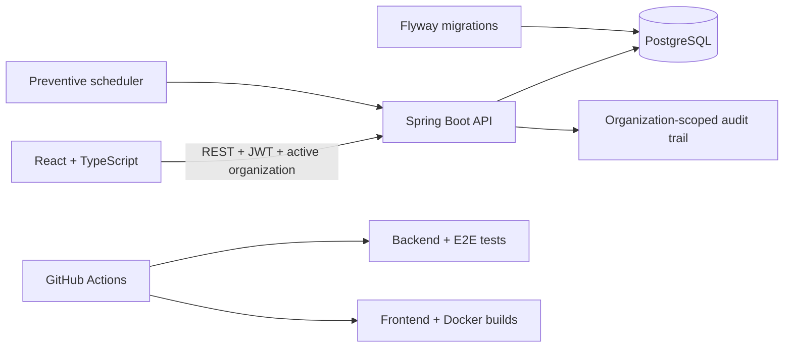

# LinePulse

Industrial maintenance and service-network platform for managing production assets, incidents, preventive and corrective maintenance, downtime, reliability indicators and multi-company maintenance workflows.

## Stack

### Backend
- Java 21
- Spring Boot
- Spring Web
- Spring Security
- Spring Data JPA
- Bean Validation
- JWT authentication
- OpenAPI / Swagger UI
- PostgreSQL
- Flyway
- Maven

### Testing
- JUnit 5
- Mockito
- Spring Boot Test
- Testcontainers with PostgreSQL
- Playwright browser E2E

### Frontend
- React
- TypeScript
- Vite
- TanStack Query
- Axios
- Recharts
- Lucide React
- QRCode React
- Nginx

### Infrastructure
- Docker
- Docker Compose
- GitHub Actions
- GitHub Pages
- Render

## Architecture


```mermaid
flowchart LR
    WEB[React + TypeScript] -->|REST + JWT + active organization| API[Spring Boot API]
    API --> DB[(PostgreSQL)]
    API --> AUDIT[Organization-scoped audit trail]
    SCHED[Preventive scheduler] --> API
    FLYWAY[Flyway migrations] --> DB
    CI[GitHub Actions] --> TESTS[Backend + E2E tests]
    CI --> BUILD[Frontend + Docker builds]
```

The backend follows a layered flow for the main domains:

```text
Controller -> Service -> Repository -> PostgreSQL
```

The V3 authorization model adds an organization boundary to requests. A user can belong to multiple organizations and the effective request role is resolved from the active membership instead of trusting only the legacy global JWT role.

## Documentation

- [Architecture decisions and technical flows](docs/architecture.md)
- [Domain model and lifecycle rules](docs/domain-model.md)
- [External integrations and boundaries](docs/external-integrations.md)
- [Multi-organization service network](docs/multi-organization-service-network.md)
- [V3 provider service network](docs/v3-provider-service-network.md)
- [Production deployment](docs/deployment.md)
- [V3 release validation and email onboarding](docs/v3-release-validation.md)

## Organization model

V3 supports two organization types:

- `COMPANY` — industrial company that owns plants, sectors, lines, machines, incidents and work orders.
- `SERVICE_PROVIDER` — maintenance provider that can receive service requests from trusted companies.

Organization memberships define the effective role inside each workspace:

- `OWNER`
- `ADMIN`
- `TECHNICIAN`
- `OPERATOR`
- `MECHANIC`

The active workspace can be selected through the frontend and is sent to the API using `X-LinePulse-Organization`.

## Current features

### Industrial operations and reliability
- Closed-access authentication using employee registration + BCrypt password + JWT.
- Login attempt throttling after repeated failures.
- Administrator-only user creation and lifecycle management for legacy administration flows.
- Industrial hierarchy: plant → sector → production line → machine.
- Create, edit, activate/deactivate and administrate industrial structure.
- Machine operational status management.
- Machine search and filters.
- Individual machine workspace with asset data, 24-hour availability, MTTR, incidents, work orders, downtime and timeline.
- QR Code and deep link for each machine workspace.
- Incident categories, priorities and lifecycle.
- Root-cause and applied-solution capture.
- Searchable incident history.
- Preventive maintenance plans with recurrence and next due date.
- Hourly scheduler that generates due preventive work orders automatically.
- Corrective, preventive and inspection work orders.
- Work-order lifecycle and searchable history.
- Downtime registration and closing.
- Availability calculation using real downtime intervals.
- MTTR calculation using completed maintenance orders.
- Operational indicators by production line and machine.
- Operational risk list and seven-day incident trend.
- CSV export for incidents, work orders, downtime and audit history.
- Paginated API endpoints for high-volume histories.

### V3 multi-company service network
- Multi-organization memberships and workspace selection.
- Organization-scoped authorization and data isolation.
- Effective role resolution from the active organization membership.
- Company ↔ service-provider trust relationships.
- Provider onboarding with its own owner account.
- Organization-local team management for technicians and mechanics.
- Internal or external service-request creation.
- Provider queue across trusted customer companies.
- Service-request priority, ETA and execution lifecycle.
- Provider accept/decline flow.
- Technician/mechanic assignment.
- External `EN_ROUTE` state.
- Start, complete and company-approval workflow.
- Service notes and parts-used recording.
- Automatic work-order creation when a request is accepted.
- Synchronization between service-request lifecycle and the linked V2 work order.
- Audit events mirrored to both organizations for shared external service actions.
- Tenant-scoped audit trail.
- Operational alerts for new provider requests, critical requests, expired ETA and company approval pending.

### Security and quality
- Backend role enforcement with organization-aware authority resolution.
- Cross-tenant isolation tests with PostgreSQL/Testcontainers.
- Tests that reject access to another provider's request even when the UUID is known.
- Audit isolation by organization.
- Production demo accounts disabled by default.
- OpenAPI documentation with Bearer JWT authentication.
- Unit and integration tests for lifecycle, authorization, incidents, maintenance, service network, alerts and dashboard indicators.
- Playwright E2E coverage for role-specific frontend access.
- CI validating backend tests, frontend build, browser E2E and Docker Compose stack.
- Docker smoke test with PostgreSQL, API and `/api/health`.
- Production frontend deployment through GitHub Pages.

## Service-request lifecycle

External flow:

```text
Company opens request
  -> Provider receives request
  -> ACCEPT / DECLINE
  -> ETA
  -> EN_ROUTE
  -> IN_PROGRESS
  -> COMPLETED
  -> Company APPROVED
```

Accepting a request creates a linked corrective work order. Starting, completing or cancelling the request keeps the work order synchronized.

Internal requests use the same service-request model but are executed by the company's own technical team.

## Operational alerts

The dashboard alert stream currently covers:

- critical active incidents;
- prolonged downtime;
- critical pending work orders;
- preventive maintenance due soon or overdue;
- new external service requests for providers;
- critical external requests;
- accepted/en-route requests whose ETA has expired;
- completed service requests waiting for company approval.

## Scalable list endpoints

```text
GET /api/incidents/page?page=0&size=25
GET /api/work-orders/page?page=0&size=25
GET /api/audit-events/page?page=0&size=50
GET /api/service-requests?page=0&size=25
```

Page size is capped at 100 records where pagination is supported.

## Project structure

```text
LinePulse/
├── backend/
│   ├── src/main/java/com/linepulse/
│   │   ├── alert/
│   │   ├── asset/
│   │   ├── audit/
│   │   ├── auth/
│   │   ├── dashboard/
│   │   ├── downtime/
│   │   ├── incident/
│   │   ├── maintenance/
│   │   ├── organization/
│   │   └── service/
│   ├── src/test/java/com/linepulse/
│   └── Dockerfile
├── frontend/
│   ├── e2e/
│   ├── src/
│   │   ├── ServiceNetworkPanel.tsx
│   │   └── services/
│   ├── Dockerfile
│   └── nginx.conf
├── docs/
├── .github/workflows/
├── docker-compose.yml
└── render.yaml
```

## Run the complete stack locally

```bash
docker compose up --build
```

After containers start:

```text
Frontend: http://localhost:5173
API: http://localhost:8080/api
Swagger: http://localhost:8080/swagger-ui/index.html
PostgreSQL: localhost:5432
```

### Local demo users

Docker Compose can enable demo users for local development. Public production deployment keeps demo initialization disabled.

Default local roles:

| Role | Registration | Password |
| --- | --- | --- |
| Admin | `ADM001` | `LinePulse123!` |
| Technician | `TEC001` | `LinePulse123!` |
| Operator | `OPE001` | `LinePulse123!` |

Stop the stack:

```bash
docker compose down
```

Remove the local PostgreSQL volume as well:

```bash
docker compose down -v
```

## Run services manually

Start PostgreSQL:

```bash
docker compose up -d postgres
```

Backend:

```bash
cd backend
mvn spring-boot:run
```

Frontend:

```bash
cd frontend
npm install
npm run dev
```

Browser tests:

```bash
cd frontend
npx playwright install chromium
npm run test:e2e
```

## API documentation

With the backend running locally:

```text
http://localhost:8080/swagger-ui/index.html
```

OpenAPI JSON:

```text
http://localhost:8080/v3/api-docs
```

Authenticate through `/api/auth/login`, then use the returned Bearer token in Swagger.

## Environment variables

Backend production environments should define at least:

```text
DATABASE_URL
DATABASE_USER
DATABASE_PASSWORD
JWT_SECRET
CORS_ALLOWED_ORIGINS
```

The datasource also supports:

```text
DATABASE_HOST
DATABASE_PORT
DATABASE_NAME
```

Optional/development variables:

```text
DEMO_USERS_ENABLED
DEMO_USERS_PASSWORD
JWT_EXPIRATION_MINUTES
```

Frontend:

```text
VITE_API_URL
```

For production, keep `DEMO_USERS_ENABLED=false`.

## External integration boundaries

Binary photos/files are intentionally not stored on the Render application filesystem. Durable attachments require object storage such as S3-compatible storage.

AI-assisted incident classification is not faked with hard-coded rules. The domain model is ready for a future model/provider integration.

External notification delivery can later consume operational events through webhook, e-mail or messaging integrations. The current product already exposes in-app operational alerts.

## Next priorities

- Durable object storage for service photos and technical attachments.
- External e-mail/webhook/message delivery for service-network events.
- Production observability and structured telemetry.
- Stronger distributed login throttling if the backend scales beyond one instance.
- More browser E2E coverage specifically for V3 workspace switching and service-request execution.
- Destructive security/authorization QA across tenant boundaries before production commercialization.

## Status

Platform administration and first-account setup: [deployment guide](docs/platform-administration.md). The platform account uses mandatory TOTP, has no tenant memberships, provisions organizations with owner invitations, and accesses support workspaces with separate audit records.

**LinePulse V3 — multi-organization industrial maintenance and provider service network in active development.**

Core V2 maintenance/reliability flows remain supported and are integrated with the V3 service-request lifecycle.

## Author

Samara Konkol
