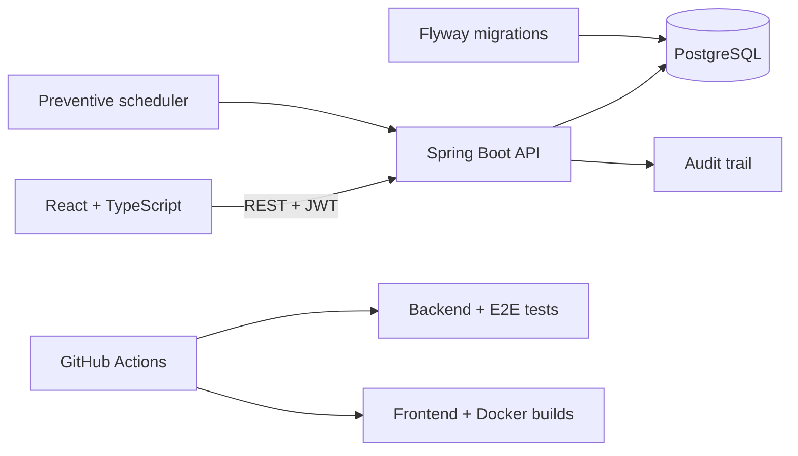

# LinePulse

Industrial maintenance and operations platform for managing production assets, incidents, preventive and corrective maintenance, downtime, reliability history and operational indicators.

## Stack

### Backend
- Java 21
- Spring Boot
- Spring Web
- Spring Security
- Spring Data JPA
- Bean Validation
- JWT authentication
- OpenAPI / Swagger UI
- PostgreSQL
- Flyway
- Maven

### Testing
- JUnit 5
- Mockito
- Spring Boot Test
- Testcontainers with PostgreSQL
- Playwright browser E2E

### Frontend
- React
- TypeScript
- Vite
- TanStack Query
- Axios
- Recharts
- Lucide React
- QRCode React
- Nginx

### Infrastructure
- Docker
- Docker Compose
- GitHub Actions
- GitHub Pages
- Render

## Architecture


```mermaid
flowchart LR
    WEB[React + TypeScript] -->|REST + JWT| API[Spring Boot API]
    API --> DB[(PostgreSQL)]
    API --> AUDIT[Audit trail]
    SCHED[Preventive scheduler] --> API
    FLYWAY[Flyway migrations] --> DB
    CI[GitHub Actions] --> TESTS[Backend + E2E tests]
    CI --> BUILD[Frontend + Docker builds]
```

The backend follows a layered flow for the main domains:

```text
Controller -> Service -> Repository -> PostgreSQL
```

## Documentation

- [Architecture decisions and technical flows](docs/architecture.md)
- [Domain model and lifecycle rules](docs/domain-model.md)
- [External integrations and v2 boundaries](docs/external-integrations.md)

## Roles

- `ADMIN` — industrial structure, assets, preventive planning, users and operational management
- `TECHNICIAN` — maintenance execution, incident diagnosis, downtime and operational machine status
- `OPERATOR` — operational visibility and incident reporting

## Current features

- Closed-access authentication using employee registration + BCrypt password + JWT
- Administrator-only user creation, role management, activation/deactivation and deletion
- Role-based API authorization enforced in the backend
- Industrial hierarchy administration: plant → sector → production line → machine
- Create, edit and activate/deactivate plants, sectors and production lines
- Machine registration and structural editing restricted to administrators
- Machine retirement/reactivation restricted to administrators
- Machine operational status management for technicians and administrators
- Machine search and filters by line, status and manufacturer
- Individual machine workspace with asset data, 24-hour availability, MTTR, incidents, work orders, downtime and event timeline
- QR Code and deep link for direct access to each machine workspace
- Incident categories: mechanical, electrical, hydraulic, pneumatic, safety, process and other
- Incident lifecycle: open, in progress, resolved and cancelled
- Root-cause and applied-solution capture when technicians resolve incidents
- Searchable incident history with status, priority and category filters
- Preventive maintenance plans with recurrence, next due date, priority and activation lifecycle
- Hourly scheduler that generates due preventive work orders automatically
- Manual preventive work-order generation when needed
- Maintenance work order creation, start and completion lifecycle
- Searchable maintenance history with status, type and priority filters
- Internal alerts for critical incidents, prolonged downtime, critical work orders and preventive maintenance due within seven days
- Downtime registration and closing
- Availability calculation using real downtime intervals
- MTTR calculation using completed maintenance orders
- Operational indicators grouped by production line and machine
- Operational risk list for assets that require attention
- Interactive dashboard cards that navigate to the related operational context
- Seven-day incident trend chart backed by API data
- Persistent audit trail with authenticated employee registration and timestamp
- Audit filters by employee registration, action, entity and period
- CSV export for incidents, maintenance work orders, downtime and audit history
- Paginated API endpoints for incidents, work orders and audit events, while legacy list endpoints remain compatible with the current UI
- Administrator user filters by name/registration, role and status
- API-derived error messages for administrative and operational actions
- Responsive React interface with green, copper, steel and verdigris visual identity
- PostgreSQL schema managed with Flyway migrations
- OpenAPI documentation with Bearer JWT authentication
- Unit and integration tests for lifecycle, authorization, incidents, maintenance, alerts and dashboard indicators
- Playwright E2E coverage validating role-specific frontend access
- CI pipeline validating backend tests, frontend build, browser E2E and Docker Compose build
- Production frontend on GitHub Pages and API/PostgreSQL deployment prepared for Render

## Scalable list endpoints

The current dashboard still uses compact list endpoints for its live operational view. Larger consumers can use paginated endpoints:

```text
GET /api/incidents/page?page=0&size=25
GET /api/work-orders/page?page=0&size=25
GET /api/audit-events/page?page=0&size=50
```

Page size is capped at 100 records.

## Project structure

```text
LinePulse/
├── backend/
│   ├── src/main/java/com/linepulse/
│   │   ├── alert/
│   │   ├── asset/
│   │   ├── audit/
│   │   ├── auth/
│   │   ├── common/
│   │   ├── config/
│   │   ├── dashboard/
│   │   ├── downtime/
│   │   ├── incident/
│   │   └── maintenance/
│   ├── src/test/java/com/linepulse/
│   └── Dockerfile
├── frontend/
│   ├── e2e/
│   ├── src/
│   ├── Dockerfile
│   └── nginx.conf
├── docs/
├── .github/workflows/
└── docker-compose.yml
```

## Run the complete stack with Docker

```bash
docker compose up --build
```

After the containers start:

```text
Frontend: http://localhost:5173
API: http://localhost:8080/api
Swagger: http://localhost:8080/swagger-ui/index.html
PostgreSQL: localhost:5432
```

### Demo users

Docker Compose enables local demo users automatically:

| Role | Registration | Password |
| --- | --- | --- |
| Admin | `ADM001` | `LinePulse123!` |
| Technician | `TEC001` | `LinePulse123!` |
| Operator | `OPE001` | `LinePulse123!` |

Demo user creation is disabled by default outside the Docker development configuration. Do not enable demo users with public credentials in a production environment.

Stop the stack with:

```bash
docker compose down
```

To also remove the local PostgreSQL volume:

```bash
docker compose down -v
```

## Run services manually

Start only PostgreSQL:

```bash
docker compose up -d postgres
```

Run the backend:

```bash
cd backend
mvn spring-boot:run
```

Run the frontend:

```bash
cd frontend
npm install
npm run dev
```

Run browser tests:

```bash
cd frontend
npx playwright install chromium
npm run test:e2e
```

To enable the three demo users when running the backend manually, define:

```text
DEMO_USERS_ENABLED=true
DEMO_USERS_PASSWORD=LinePulse123!
```

## API documentation

With the backend running locally:

```text
http://localhost:8080/swagger-ui/index.html
```

The OpenAPI specification is available at:

```text
http://localhost:8080/v3/api-docs
```

Authenticate through `/api/auth/login` using employee registration and password, copy the returned token and use the Swagger `Authorize` control for protected endpoints.

## Environment variables

Backend production environments should define at least:

```text
DATABASE_URL
DATABASE_USER
DATABASE_PASSWORD
JWT_SECRET
CORS_ALLOWED_ORIGINS
```

The datasource also supports `DATABASE_HOST`, `DATABASE_PORT` and `DATABASE_NAME` when a full `DATABASE_URL` is not supplied.

Optional development variables:

```text
DEMO_USERS_ENABLED
DEMO_USERS_PASSWORD
JWT_EXPIRATION_MINUTES
```

Frontend:

```text
VITE_API_URL
```

The Docker Compose configuration uses local development defaults and supports overriding `JWT_SECRET`, `DEMO_USERS_PASSWORD` and `VITE_API_URL` through environment variables.

## External integration boundaries

Binary photo/file attachments are intentionally not stored on the Render application filesystem because free/ephemeral instances do not provide a suitable durable attachment store. Production attachment upload requires an object-storage destination such as S3-compatible storage.

AI-assisted incident classification is also intentionally not faked with hard-coded rules. The domain model now has technical categories, priorities and diagnosis fields ready for an AI suggestion layer once a model/provider and credential are configured.

External notification delivery can later consume the existing operational alerts through a webhook, e-mail or messaging integration. Internal alerting already covers the operational rules without external credentials.

## Roadmap

- Durable object storage for photos and technical attachments
- Optional webhook/e-mail delivery for operational alerts
- AI-assisted incident classification and troubleshooting suggestions
- Production observability and deployment hardening
- Migrate high-volume UI histories to paginated endpoints when dataset size requires it

## Status

LinePulse v2 — maintenance planning and reliability workspace in active development.

## Author

Samara Konkol
