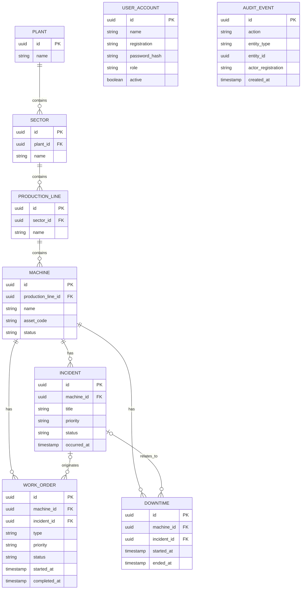

# LinePulse Domain Model

## Entity relationships



## Main lifecycle rules

### Incident

```text
OPEN → IN_PROGRESS → RESOLVED
  └───────────────→ CANCELLED
```

- new incidents start as `OPEN`;
- only an open incident can be started;
- only an incident in progress can be resolved;
- open or in-progress incidents can be cancelled;
- resolved and cancelled incidents are terminal.

### Maintenance work order

```text
OPEN → IN_PROGRESS → COMPLETED
```

- new work orders start as `OPEN`;
- only open work orders can be started;
- only work orders in progress can be completed;
- start and completion timestamps are used to calculate MTTR.

### Downtime

A downtime record has a start timestamp and an optional end timestamp.

- `endedAt = null` means the machine is still in the recorded downtime interval;
- closing a downtime requires an end timestamp after its start;
- overlapping intervals are clipped to the dashboard's 24-hour availability window.

## Ownership and references

A work order or downtime record can optionally reference an incident, but when a reference is provided the incident must belong to the same machine.

This rule prevents linking an operational event from one asset to maintenance or downtime data from another asset.

## User access

Users are identified by a unique employee registration rather than e-mail. Accounts are created and removed by administrators. Passwords are stored only as BCrypt hashes and the current product does not expose a password-change workflow.

Deleting a user removes access immediately because authenticated requests reload the current user from PostgreSQL before Spring Security authorizes the request.

## Audit model

Audit events intentionally use a generic `entityType + entityId` pair instead of foreign keys to every domain table. This keeps the audit subsystem independent of individual domain relationships and allows it to record actions for multiple entity types through one structure.

The audit actor is stored as the employee registration, so historical actions remain attributable even if the user account is later deleted.
