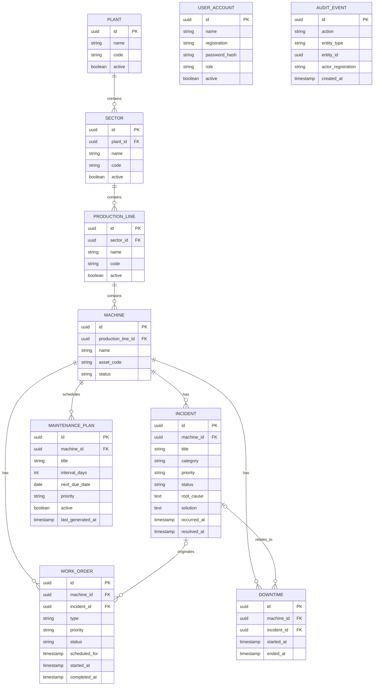

# LinePulse Domain Model

## Entity relationships


```mermaid
erDiagram
    PLANT ||--o{ SECTOR : contains
    SECTOR ||--o{ PRODUCTION_LINE : contains
    PRODUCTION_LINE ||--o{ MACHINE : contains

    MACHINE ||--o{ INCIDENT : has
    MACHINE ||--o{ WORK_ORDER : has
    MACHINE ||--o{ DOWNTIME : has
    MACHINE ||--o{ MAINTENANCE_PLAN : schedules

    INCIDENT o|--o{ WORK_ORDER : originates
    INCIDENT o|--o{ DOWNTIME : relates_to

    USER_ACCOUNT {
        uuid id PK
        string name
        string registration
        string password_hash
        string role
        boolean active
    }

    PLANT {
        uuid id PK
        string name
        string code
        boolean active
    }

    SECTOR {
        uuid id PK
        uuid plant_id FK
        string name
        string code
        boolean active
    }

    PRODUCTION_LINE {
        uuid id PK
        uuid sector_id FK
        string name
        string code
        boolean active
    }

    MACHINE {
        uuid id PK
        uuid production_line_id FK
        string name
        string asset_code
        string status
    }

    INCIDENT {
        uuid id PK
        uuid machine_id FK
        string title
        string category
        string priority
        string status
        text root_cause
        text solution
        timestamp occurred_at
        timestamp resolved_at
    }

    MAINTENANCE_PLAN {
        uuid id PK
        uuid machine_id FK
        string title
        int interval_days
        date next_due_date
        string priority
        boolean active
        timestamp last_generated_at
    }

    WORK_ORDER {
        uuid id PK
        uuid machine_id FK
        uuid incident_id FK
        string type
        string priority
        string status
        timestamp scheduled_for
        timestamp started_at
        timestamp completed_at
    }

    DOWNTIME {
        uuid id PK
        uuid machine_id FK
        uuid incident_id FK
        timestamp started_at
        timestamp ended_at
    }

    AUDIT_EVENT {
        uuid id PK
        string action
        string entity_type
        uuid entity_id
        string actor_registration
        timestamp created_at
    }
```

## Industrial hierarchy lifecycle

Plants, sectors and production lines use an `active` flag instead of destructive deletion. Administrators can edit names/codes and move a sector to another plant or a line to another sector. New machines can only be assigned through the active hierarchy.

Machines use operational statuses for day-to-day work. `INACTIVE` is reserved for the administrative retirement/reactivation lifecycle so historical incidents, maintenance and downtime remain attributable to the asset.

## Incident lifecycle

```text
OPEN → IN_PROGRESS → RESOLVED
  └───────────────→ CANCELLED
```

- new incidents start as `OPEN`;
- operators select a technical category and priority when reporting;
- only an open incident can be started;
- only an incident in progress can be resolved;
- resolving requires a root cause and applied solution;
- open or in-progress incidents can be cancelled;
- resolved and cancelled incidents are terminal.

Technical categories are `MECHANICAL`, `ELECTRICAL`, `HYDRAULIC`, `PNEUMATIC`, `SAFETY`, `PROCESS` and `OTHER`.

## Preventive maintenance plan

A preventive plan belongs to one machine and defines a title, procedure, recurrence interval in days, next due date, priority and active state.

When an active plan reaches its due date, the scheduler generates a regular `PREVENTIVE` work order through the existing maintenance domain. The plan then advances its due date until the next date is in the future. This prevents a long-offline environment from creating one historical order for every missed recurrence.

Administrators can also generate the next preventive order manually, edit a plan, pause it or reactivate it.

## Maintenance work order lifecycle

```text
OPEN → IN_PROGRESS → COMPLETED
```

- new work orders start as `OPEN`;
- corrective/inspection orders can be created by technician/admin workflows;
- preventive orders can be generated from maintenance plans;
- only open work orders can be started;
- only work orders in progress can be completed;
- start and completion timestamps are used to calculate MTTR.

## Downtime

A downtime record has a start timestamp and an optional end timestamp.

- `endedAt = null` means the machine is still in the recorded downtime interval;
- closing a downtime requires an end timestamp after its start;
- overlapping intervals are clipped to the dashboard's 24-hour availability window.

## Ownership and references

A work order or downtime record can optionally reference an incident, but when a reference is provided the incident must belong to the same machine.

This rule prevents linking an operational event from one asset to maintenance or downtime data from another asset.

## User access

Users are identified by a unique employee registration rather than e-mail. Accounts are created and removed by administrators. Passwords are stored only as BCrypt hashes and the current product does not expose a password-change workflow.

Deleting a user removes access immediately because authenticated requests reload the current user from PostgreSQL before Spring Security authorizes the request.

## Audit model

Audit events intentionally use a generic `entityType + entityId` pair instead of foreign keys to every domain table. This keeps the audit subsystem independent of individual domain relationships and allows it to record actions for multiple entity types through one structure.

The audit actor is stored as the employee registration, so historical actions remain attributable even if the user account is later deleted. Scheduler-generated actions are recorded with the system context when there is no authenticated employee.
